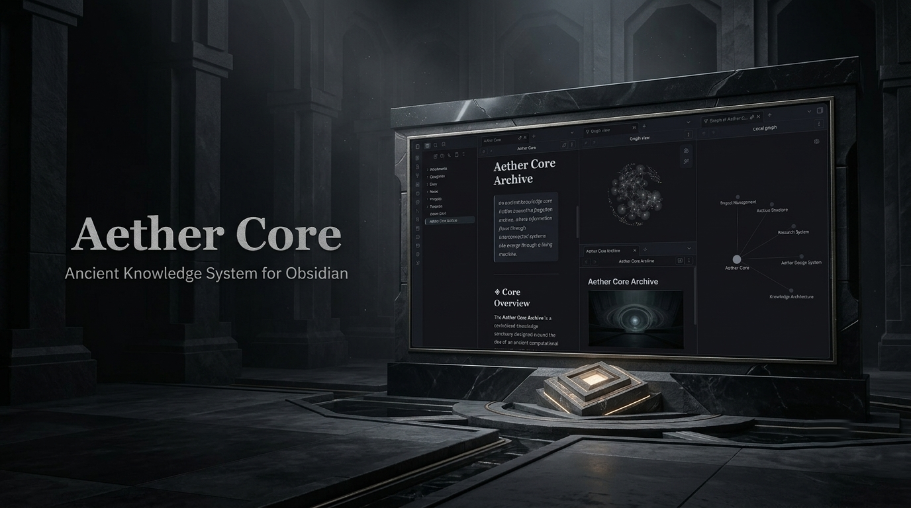
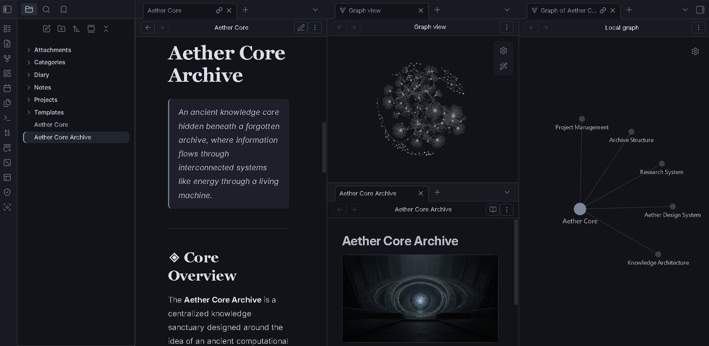
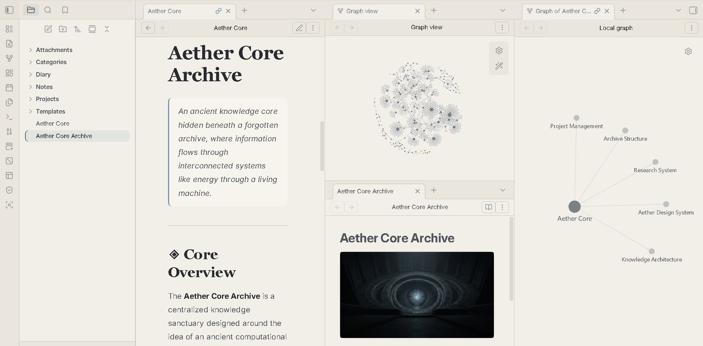
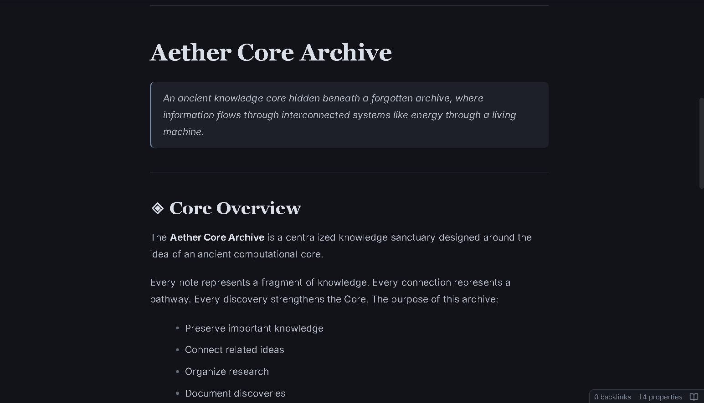
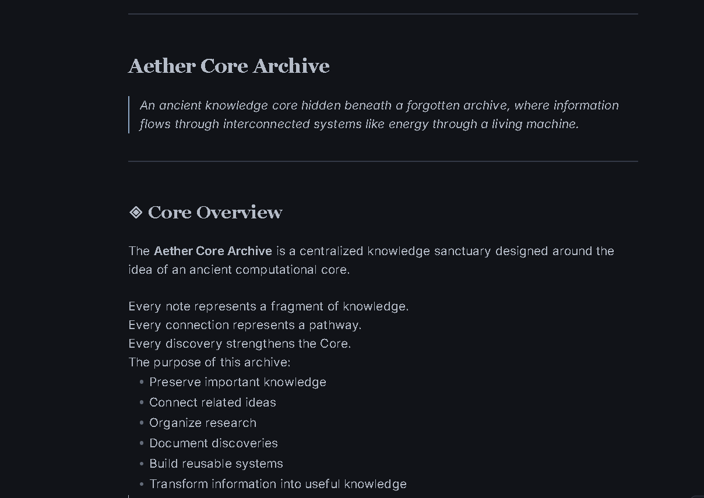
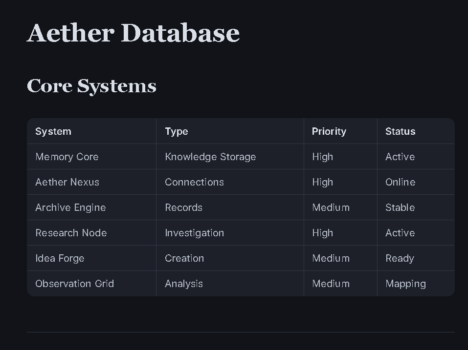
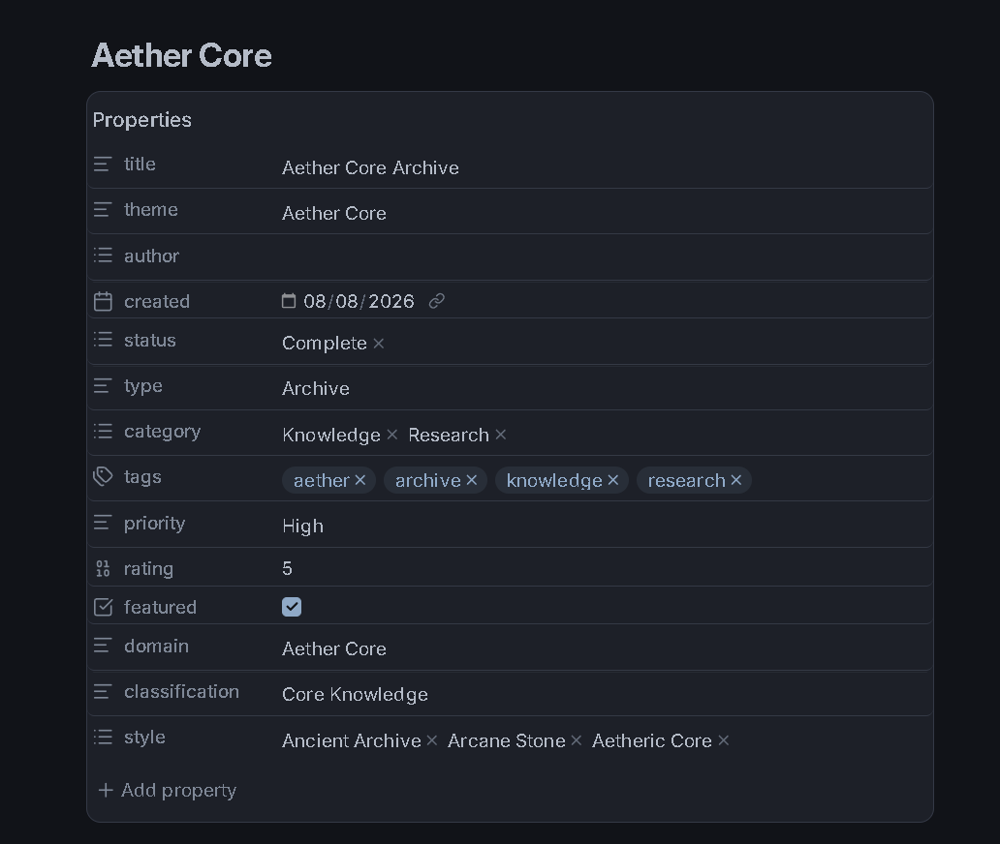
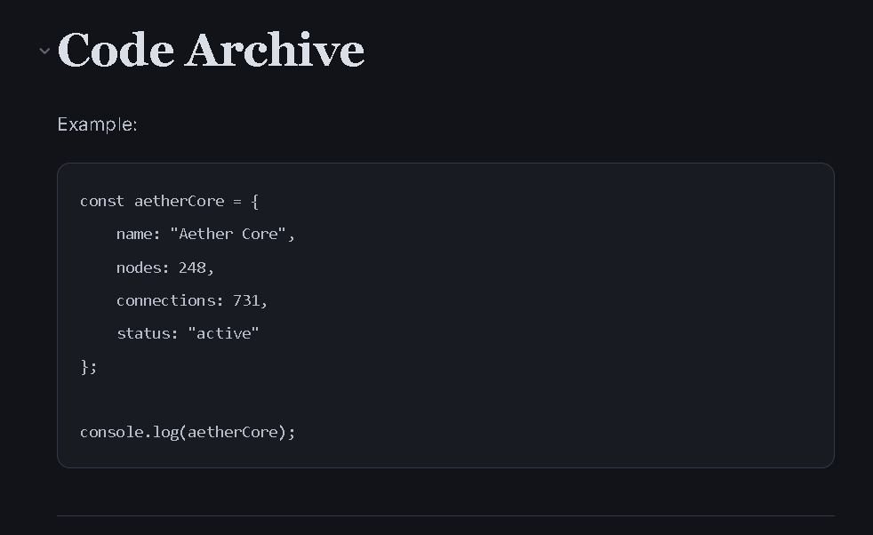
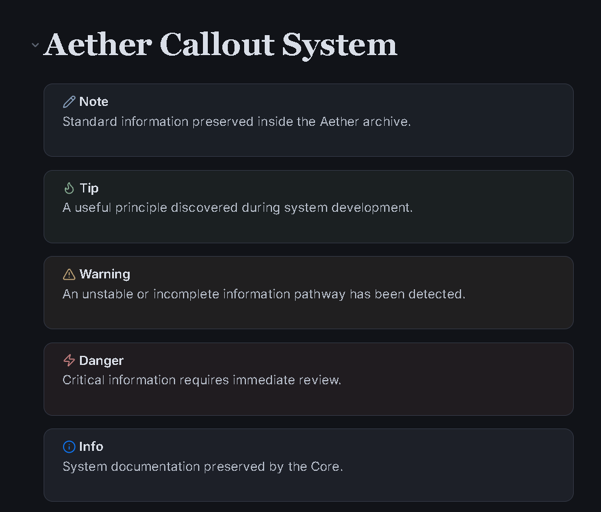

# Aether Core


A handcrafted Obsidian theme inspired by **ancient knowledge archives, refined materials, atmospheric depth, and the quiet energy hidden beneath the surface.**

Aether Core is designed as a calm knowledge environment where the interface supports your work without competing with it.

Designed for:

- Comfortable long-form reading
- Focused writing sessions
- Research workflows
- Knowledge management
- Coding
- Worldbuilding
- Long-term daily use
- Low-glare work sessions

---

# Preview



**A calm knowledge environment built around refined materials, atmospheric depth, and a quiet central core.**

---

# Support ☕

If you enjoy Aether Core and want to support future development:

Your support helps with:

- New theme editions
- Plugin compatibility
- Long-term maintenance
- Community improvements

## Buy Me A Coffee

<a href="https://www.buymeacoffee.com/CosmicSeaFox" target="_blank">

</a>

## Ko-fi

<a href="https://ko-fi.com/cosmicseafox" target="_blank">

</a>

---

# Screenshots

## Dark Mode



A deep atmospheric workspace built from layered surfaces and controlled accent energy.

Features:

- Deep core surfaces
- Refined material layers
- Soft accent lighting
- Comfortable text contrast
- Low-glare atmosphere

---

## Light Mode



A bright material environment designed for comfortable daytime work.

Features:

- Warm light surfaces
- Refined panels
- Soft mineral borders
- Comfortable contrast
- Clean academic atmosphere

---

## Reading Experience



Designed for long writing and reading sessions.

- Comfortable typography
- Balanced content width
- Clear hierarchy
- Soft contrast
- Reduced visual noise

---

## Source Mode



A focused editing environment for writers, researchers, and developers.

---

## Tables



Tables are integrated into the same surface system as the rest of the theme.

- Unified background
- No zebra-striping
- Soft borders
- Subtle hover feedback
- Consistent material appearance

The goal is simple:

> Tables should feel like part of the note, not a separate spreadsheet.

---

## Graph View


A refined knowledge network designed to fit naturally into the Aether Core environment.

---

## Properties Panel



Metadata is presented as part of the same material system rather than as a separate interface.

---

## Code Blocks



A calm technical environment designed for readable code without excessive glow or contrast.

---

## Callouts



Structured information panels with controlled visual emphasis for important knowledge.

---

# Features

| Feature | Description |
|---|---|
| 🌑 Dark Mode | Deep atmospheric workspace |
| ☀️ Light Mode | Refined daylight workspace |
| 📖 Reading Mode | Comfortable long-form reading |
| ✍️ Source Mode | Focused writing environment |
| 🎨 Aether System | Unified material and accent system |
| 🪨 Material Surfaces | Layered interface depth |
| 📊 Tables | Unified surface-style tables |
| 💻 Code Blocks | Calm technical presentation |
| 🗂 Properties | Integrated metadata panels |
| 🕸 Graph View | Refined knowledge network |
| 🏷 Tags | Integrated accent styling |
| ☑ Tasks | Clear task states |
| 📅 Calendar | Consistent interface styling |
| 📱 Mobile | Responsive layouts |

---

# Aether Color System

Aether Core uses a controlled accent system rather than covering the interface with bright colors.

| Variant | Character |
|---|---|
| Aether Blue | Primary atmospheric accent |
| Deep Violet | Secondary depth |
| Mineral Cyan | Cool highlight |
| Emerald | Natural secondary accent |
| Solar Gold | Warm emphasis |
| Moon Silver | Neutral highlight |
| Core White | Light-mode clarity |

### Core Principle

> **90% calm material, 10% accent energy.**

Accent colors are reserved for:

- Important states
- Active elements
- Navigation
- Interaction
- Selected content
- Visual emphasis

The interface remains calm while the accent system provides controlled energy.

---

# Material System

Aether Core is built around layered surfaces.

| Layer | Purpose |
|---|---|
| Core Surface | Main workspace |
| Primary Surface | Editor and writing areas |
| Raised Surface | Panels and tables |
| Glass Layer | Special interface elements |
| Accent Layer | Active and important states |

The material system follows one rule:

> **Everything should feel like it belongs to the same environment.**

Nothing should appear pasted onto the interface.

---

# Table Design

Tables use the same material language as the rest of Aether Core.

| Element | Design |
|---|---|
| Header | Elevated surface |
| Body | Single continuous surface |
| Rows | No alternating colors |
| Borders | Soft mineral edges |
| Hover | Subtle accent reflection |

Aether Core deliberately avoids zebra-striped tables.

The intended feeling is:

> **A table carved into the same surface as the note.**

---

# Typography

| Purpose | Font |
|---|---|
| Body | Inter |
| Headings | Cormorant Garamond |
| Code | JetBrains Mono |

Typography is designed to remain elegant without sacrificing readability.

The content always remains more important than decoration.

---

# Installation

1. Download this repository.

2. Copy the theme folder into:

```text
YourVault/.obsidian/themes/
```

3. Open Obsidian.

4. Go to:

```text
Settings → Appearance → Themes
```

5. Select:

```text
Aether Core
```

---

# Compatibility

| Feature | Status |
|---|---|
| Obsidian Desktop | ✅ |
| Obsidian Mobile | ✅ |
| Reading Mode | ✅ |
| Source Mode | ✅ |
| Live Preview | ✅ |
| Graph View | ✅ |
| Properties | ✅ |
| Tables | ✅ |
| Callouts | ✅ |
| Code Blocks | ✅ |
| Dataview | ✅ |
| Tasks | ✅ |
| Calendar | ✅ |
| Kanban | ✅ |
| Canvas | ✅ |
| Excalidraw | ✅ |

---

# Design Philosophy

Aether Core focuses on:

- Calm atmosphere
- Clear information hierarchy
- Comfortable reading
- Focused writing
- Material consistency
- Minimal distraction
- Long-term usability
- Controlled visual energy

Created for:

- Writers
- Researchers
- Students
- Developers
- Worldbuilders
- Knowledge explorers

---

# Dark Mode

Dark mode is built around **quiet depth** rather than pure black.

Features:

- Deep atmospheric surfaces
- Layered material depth
- Controlled accent highlights
- Soft borders
- Comfortable text contrast
- Subtle ambient effects

### Goal

> **Deep, calm, and immersive without becoming visually aggressive.**

---

# Light Mode

Light mode has its own material identity rather than simply reversing the dark palette.

Features:

- Warm light surfaces
- Refined panels
- Soft mineral borders
- Comfortable dark text
- Controlled accents
- Clean daylight atmosphere

### Goal
> **Bright and comfortable while still feeling unmistakably Aether Core.**
---

# Aether Core Concept

## The Quiet Core

Aether Core is built around a simple idea:

> **The interface should support knowledge, not compete with it.**

The theme uses atmosphere carefully.

Material provides the structure.

Typography provides clarity.

Accent colors provide energy.

Effects provide depth.

The content remains at the center.

---

# Visual Balance

Aether Core follows a controlled visual balance:

| Element | Role |
|---|---|
| Material | Foundation |
| Typography | Information |
| Accent | Energy |
| Glass | Depth |
| Glow | Emphasis |
| Decoration | Minimal |

The design avoids turning every element into a visual feature.

> **When everything glows, nothing feels important.**

---

# Credits

### Fonts

- Inter
- Cormorant Garamond
- JetBrains Mono

Made for the Obsidian community.

---

# License

MIT License

Made with ❤️ for writers, researchers, developers, and explorers of knowledge.
